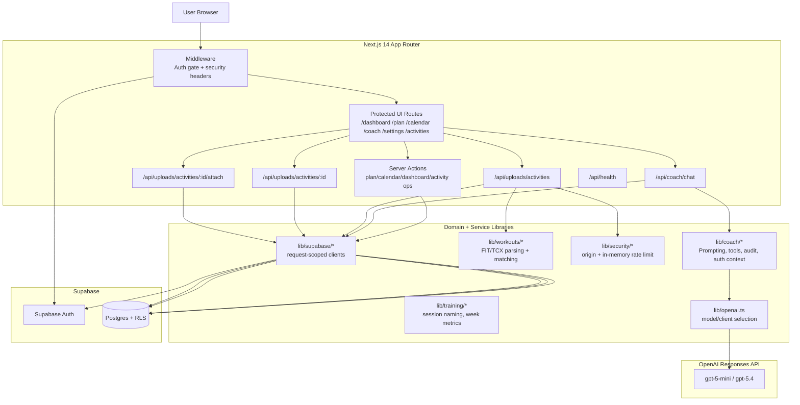

# TriCoach AI — Architecture Overview

This document gives a practical, high-level view of the current system architecture and data flow.

## System diagram

## Layered view

- **UI layer (Next.js App Router):** Protected pages render dashboard, plan, calendar, coach, settings, and activity views.
- **API / action layer:** Server Actions and route handlers coordinate writes, ingestion, chat, and linking workflows.
- **Domain layer:**
  - `lib/coach`: coach instructions, tool schemas, tool handlers, audit logging.
  - `lib/workouts`: FIT/TCX parsing and session matching logic.
  - `lib/training`: semantics and week metrics.
  - `lib/security`: origin checks and in-memory rate limiting.
- **Data layer:** Supabase Auth + Postgres with RLS policies enforced via migrations.
- **AI layer:** OpenAI Responses API called server-side only through `lib/openai.ts`.

## Core request flows

1. **Authenticated app navigation**
   - Browser request hits middleware for protected-route auth checks and security headers.
   - Authenticated requests proceed to protected UI route handlers and server components.

2. **Activity upload + matching**
   - UI calls upload API.
   - API validates origin, rate limit, file type/size, and duplicate hash.
   - Parser extracts activity data and stores upload/activity rows.
   - Matching logic suggests and/or creates session linkage candidates.

3. **Coach chat + tools**
   - UI posts user message to `/api/coach/chat`.
   - Backend resolves auth context and loads conversation continuity.
   - OpenAI response may trigger approved tool calls.
   - Tool handlers run athlete-scoped queries/writes only.
   - Assistant response and metadata are persisted.

## Notes

- This file is intentionally Git-friendly Markdown and can be committed directly.
- A copy also exists at `docs/architecture-overview.md` for docs-folder discoverability.
