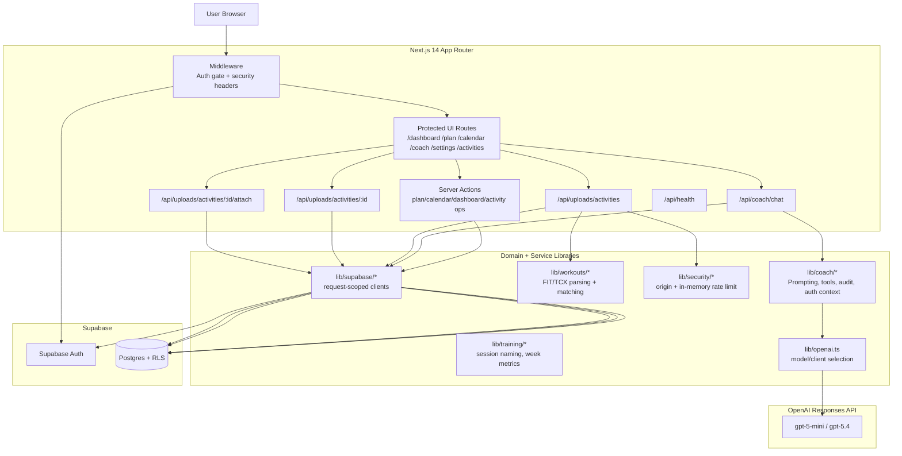

# Architecture Overview

```mermaid
flowchart TB
  U["User Browser"]

  subgraph NextApp["Next.js 14 App Router"]
    MW["Middleware\nAuth gate + security headers"]
    UI["Protected UI Routes\n/dashboard /plan /calendar /coach /settings /activities"]
    SA["Server Actions\nplan/calendar/dashboard/activity ops"]
    API1["/api/coach/chat"]
    API2["/api/uploads/activities"]
    API3["/api/uploads/activities/:id"]
    API4["/api/uploads/activities/:id/attach"]
    API5["/api/health"]
  end

  subgraph DomainLib["Domain + Service Libraries"]
    Coach["lib/coach/*\nPrompting, tools, audit, auth context"]
    Workouts["lib/workouts/*\nFIT/TCX parsing + matching"]
    Sec["lib/security/*\norigin + in-memory rate limit"]
    Train["lib/training/*\nsession naming, week metrics"]
    SB["lib/supabase/*\nrequest-scoped clients"]
    OA["lib/openai.ts\nmodel/client selection"]
  end

  subgraph Data["Supabase"]
    Auth["Supabase Auth"]
    DB[("Postgres + RLS")]
  end

  subgraph AI["OpenAI Responses API"]
    LLM["gpt-5-mini / gpt-5.4"]
  end

  U --> MW --> UI
  UI --> SA --> SB --> DB
  UI --> API1
  UI --> API2
  UI --> API3
  UI --> API4

  API1 --> Coach --> OA --> LLM
  API1 --> SB --> DB

  API2 --> Workouts
  API2 --> Sec
  API2 --> SB --> DB

  API3 --> SB --> DB
  API4 --> SB --> DB

  MW --> Auth
  SB --> Auth
```
